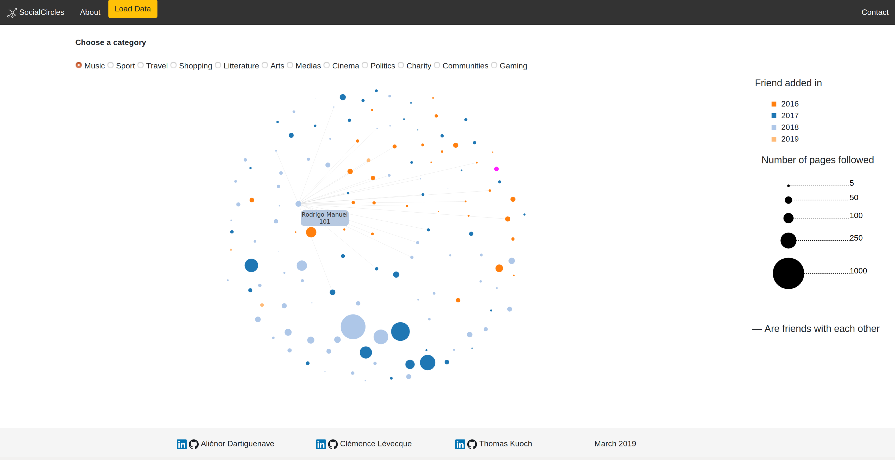

# Project description

This is a final year project realized by Thomas Kuoch, Aliénor Dartiguenave and Clémence Lévecque.
The goal is to visualize some affinities that could exist between some of our friends on Facebook.
You can visualize the work here : https://clevecque.github.io/SocialCircle/




## Create your dataset
1. You will need to download your data about your friends from Facebook. 

Go to Settings > Your Facebook information > Access your information. Here choose Download Your Information and select only friends in JSON format. You will receive a notification when your file is ready. You will only need the file called `friends.json` in it.

2. Crawl your data. You will need to download at least the /data folder from this repository. Put it somewhere in your computer and place the `friends.json` in it. There are three Python files in the folder and one JSON. Execute the Python's ones in order.

You will need the **libray bs4 (Beautiful Soup)** to execute it.

The first one will give you a list of all your friends and for each one, some information about common friends and the pages they liked. 

Warnings: 
* the code has been written for a French Facebook for now...
* with a good connexion it takes ~10s by friend, so if you have around 700 friends like me it turns around 4/5hrs and the code should not be stopped or you'll have to restart it.
```
python get_data.py your_email your_passwd your_id location_of_friends.json
```
It will create a file called `friends_data.json` in your folder, don't move it.

The second one is the longest and its job is to retrieve the category of each page that each of your friends has liked. This one is quite long to execute but can be restarted anytime, it will start again from the last point. It takes ~10 min for a friend that has liked around 450 pages.

```
python page_category.py
```
This code update the `friends_data.json` file. If you don't want to wait that long you can stop it before and just take the part from the file that has been treated. I might add a code to do that easily.

The last one only put all the data in the right format for the visualisation. You just need the `likes_categories.json` to be in the same folder.
```
python to_final_format.py
```

## Make your own visualisation
For now the button "Load data" doesn't work but it should come. In between you can just download the github and replace the `graph.json` file (example file) by the one you created.

## How the visualisation works ?
* It counts for some pre-made categories the number of common pages between all your friends. Then we compute an affinity that looks like 
)
where A is the number of pages of user A, B is the number of pages of user B and A ∩ B is the number of common pages.
* This affinity will map the nodes: the closer they are the higher number of common pages they have. This affinity is also supposed to take into account the fact that some people like a lot more pages than another and it could skew the affinity.
* The links between the nodes are drawn between some of your friends that are themselves friends.
* The color matches the year you added them
* The size matches the number of pages the liked
* For the different categories displayed you can find which sub-categories they gather in the file `likes_categories.json` and modify them if you like.

## To be developped
* Give you the possibility to choose the reason why you want to color the nodes (not only the year you added them but also the gender, their age or their current localisation).
* Finalise the "Load Data" button
* Add a pop-up explanation panel with the disclaimer.

## Disclaimer
The data displayed depends on each user. It uses data that YOU have access to but other people might not so try not putting your files online. On our side, we are just a student project and won't have access to your data. 

Concerning using data about our Facebook's relations, it is mostly data publicly displayed, we didn't hack anything. Never forget to be careful about the data you let people have access to.
